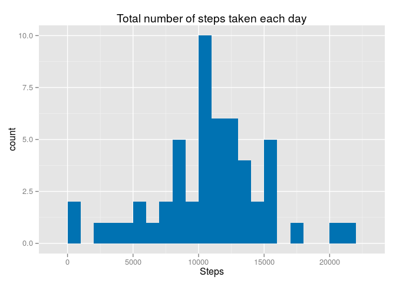
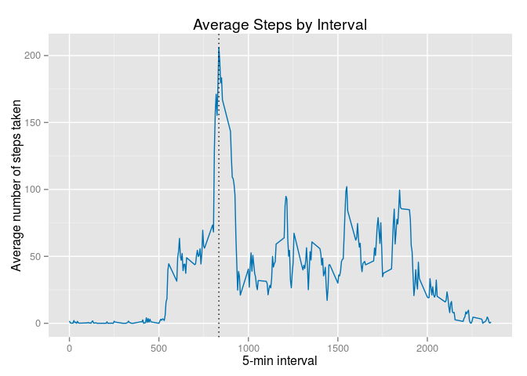
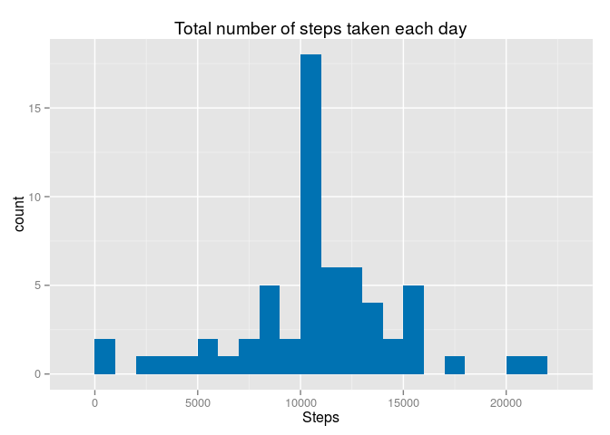
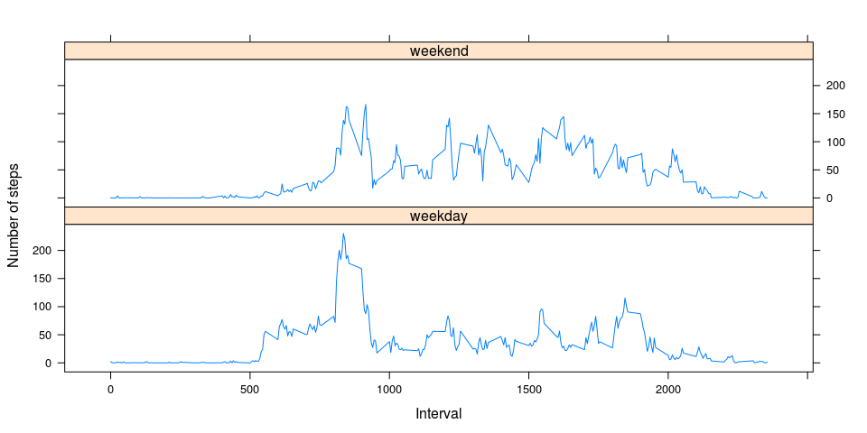

# Reproducible Research: Peer Assessment 1
Heikki Turakainen  
2015-08-16  

## Loading and preprocessing the data

Local environment settings, data preparation, and loading required libraries.


```r
# Set working directory
#setwd("D:/projects/datasci5/git/RepData_PeerAssessment1")
setwd("/home/heikki/projects/coursera/datasci5/git/RepData_PeerAssessment1")

# Check if the the zip file s already been extracted. if not done yet, extract to current working dir.
if (!file.exists("activity.csv")) {
  unzip("activity.zip")
} 

# Make sure required libraries are loaded
# TODO: Pacman is not found for some reason :(
#if (!require("pacman")) install.packages("pacman", repos="http://ftp.acc.umu.se/mirror/CRAN/")
#pacman::p_load(ggplot2, lattice)
# As a workaround, need to install package manually before executing the code, and load the libraries here:
library(ggplot2)
library(lattice)
```

Load the data
 

```r
# Load the data (i.e. read.csv())
df <- read.csv("activity.csv")
```

## What is mean total number of steps taken per day?


```r
# Create the histogram of the total number of steps taken each day
total.steps.by.day <- aggregate(steps~date, data=df, sum, na.rm=TRUE)
names(total.steps.by.day) <- c("date","steps")
histplot <- ggplot(total.steps.by.day, aes(x = steps)) +
            ggtitle("Total number of steps taken each day") +
            xlab("Steps") +
            geom_histogram(binwidth = 1000, fill = "#0072B2")
histplot
```

 

```r
# Calculate the mean of the total number of steps taken per day
mean(total.steps.by.day$steps, na.rm = TRUE)
```

```
## [1] 10766.19
```

```r
# Calculate the median of the total number of steps taken per day
median(total.steps.by.day$steps, na.rm = TRUE)
```

```
## [1] 10765
```

The mean and median of the total number of steps taken per days are 10766.19 and 10765, respectively.

## What is the average daily activity pattern?


```r
# Make a time series plot (i.e. type = "l") of the 5-minute interval (x-axis) and the average number of steps taken, averaged across all days (y-axis). The plot contains an additional vertical line marking the 5-min interval with the highest number of steps in the x-axis. 

average.steps.by.interval <- aggregate(x = df$steps, by = list(df$interval), FUN = mean, na.rm = TRUE)
names(average.steps.by.interval) <- c("interval","steps")

avg.step.line <- ggplot(average.steps.by.interval, aes(interval,steps)) +
                 ggtitle("Average Steps by Interval") +
                 geom_line(colour="#0072B2") + 
                 xlab("5-min interval") + 
                 ylab("Average number of steps taken") + 
                 geom_vline(
                   xintercept = c(average.steps.by.interval[
                     which.max(average.steps.by.interval$steps), c("interval")]), linetype = "dotted")
avg.step.line  
```

 

```r
# Which 5-minute interval, on average across all the days in the dataset, contains the maximum number of steps?
average.steps.by.interval[which.max(average.steps.by.interval$steps), c("interval")]
```

```
## [1] 835
```

The highest number of steps is in the interval number 835.

## Imputing missing values


```r
# Calculate and report the total number of missing values in the dataset (i.e. the total number of rows with NAs)
nrow(df[is.na(df$steps),])
```

```
## [1] 2304
```

```r
# Fill missing step values with mean step at time interval
df.new <- merge(x = df, y = average.steps.by.interval, by = "interval", all.x = TRUE)
df.new[is.na(df.new$steps.x), c("steps.x")] <- df.new[is.na(df.new$steps.x), c("steps.y")]

# Replace the existing dataset with the new inputted data (Not creating a new one, just modifying the existing one).
df.new$date <- as.Date(df.new$date)
df.new$date.x <- NULL
df.new$Group.1 <- NULL
df.new$steps <- df.new$steps.x
df.new$steps.x <- NULL
df.new$steps.y <- NULL
 
# Create a histogram of the total number of steps taken each day.

total.steps.by.day <- aggregate(x = df.new$steps, by = list(df.new$date), FUN = sum, na.rm = TRUE)
names(total.steps.by.day) <- c("date","steps")
histplot <- ggplot(total.steps.by.day,aes(x = steps)) +
            ggtitle("Total number of steps taken each day") +
            xlab("Steps") +
            geom_histogram(binwidth = 1000, fill = "#0072B2")
histplot 
```

 

```r
# Calculate and report the mean and median total number of steps taken per day. 

# Mean total number of steps taken per day
mean(total.steps.by.day$steps, na.rm = TRUE)
```

```
## [1] 10766.19
```

```r
# Median total number of steps taken per day
median(total.steps.by.day$steps, na.rm = TRUE)
```

```
## [1] 10766.19
```
 
The mean value (10766.19) is the same as the mean value before, because the missing values were ignored in the first calculation, and the second calculation contains the added mean values. There is a slight increase in the median value (10765 --> 10766.19), because of the added mean values to the dataset. 

## Are there differences in activity patterns between weekdays and weekends?

Make a panel plot containing a time series plot (i.e. type = "l") of the 5-minute interval (x-axis) and the average number of steps taken, averaged across all weekday days or weekend days (y-axis).


```r
# Create a day value to the data frame based on the weekday of the date value. For Sunday and Saturday : weekend, Other days : weekday
df.new$day = ifelse(as.POSIXlt(as.Date(df.new$date))$wday%%6==0, "weekend", "weekday")
df.new$day = factor(df.new$day,levels = c("weekday", "weekend"))

# Create the plot
# Note: Using xyplot here, because I did not get it right with ggplot :(
stepsInterval2 = aggregate(steps~interval+day, df.new, mean)
xyplot(steps~interval|factor(day),
       data = stepsInterval2,
       type = "l",
       layout = c(1,2), 
       xlab = "Interval", 
       ylab = "Number of steps")
```

 

Based on the graphs, there are some minor differencies between the activity patterns on weekdays and weekends.
